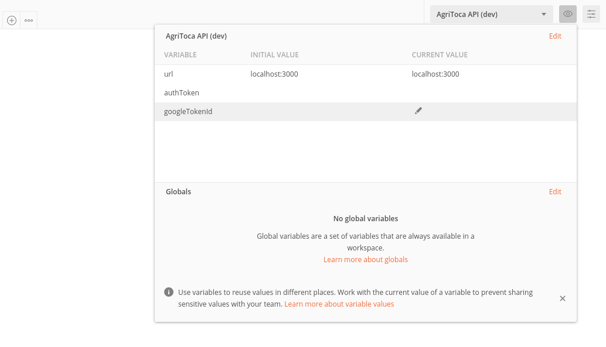

# Agritoca

## Instruções:

Para executar o programa no ambiente de desenvolvimento é necessário criar os seguintes arquivos:

```none
.
└── config
    ├── dev.env
    └── test.env
...
```

_Estes arquivos contêm as chaves de ambiente que são geralmente secretas, como: o `DB_URL`, o `JWT_SECRET`, `PORT`, etc._

Para testar somente a API, use o ambiente de produção no [Heroku](https://agritoca-api.herokuapp.com/).

### Banco de Dados:

Para configurar, e preencher o banco de dados execute o comando: `npm run dev:remake`.

_Este comando executa o equivalente a `npm run dev:clean; npm run dev:migrate; npm run dev:seed`. **Confira o `package.json`**._

**Note que apenas no ambiente de desenvolvimento estes comandos são operativos.**

### Server:

Para iniciar o aplicação basta executar o comando: `npm run dev`.

### Tests:

Para testar a aplicação execute: `npm run test` ou `npm test`.

## Postman:

Para testar a API com o Postman importe os seguintes arquivos como `collection` e `environment`, respectivamente:

```none
.
├── AgriToca.collection.json
└── AgriToca.environment.json
```

**Importante:** Para fazer uso de privilégios (mod ou admin) nas requisições, é necessário fazer login. Siga as instruções seguintes para isso:

- Vá no arquivo:

```none
.
└── database
    └── seeds
        └── 00-users.js
```

- Adicione como primeiro item da lista (dentro de `insert`) um objeto com seu `email` e o `privilege` desejado (`0`: padrão para novos usuários, `1`: para moderadores,`2`: para administradores). Exemplo:

```js
{
  email: 'thegreatwall@gmail.com',
  privilege: 2
},
```

- Execute `npm run dev:remake`. _(Para resetar o db e adicionar seu email)._

- Vá [aqui](https://get-google-token.herokuapp.com/). Entre com o `email` especificado acima. _(Para receber os dados de login do Google)._

- Após receber os dados de login do `Google`. Copie o valor presente na chave `id_token`.

- Cole na variável `googleTokenId` no Postman (Exemplo na seguinte imagem):



- Faça a `request`: **Login User (Google)**.

- Pronto! Você está autenticado.
